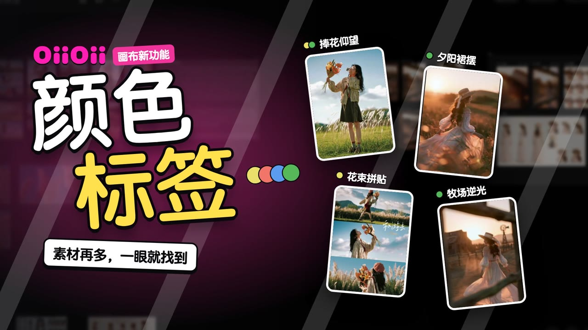
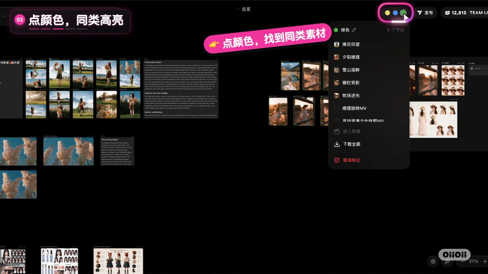

# 颜色标签功能介绍

OiiOii 画布「颜色标签」功能介绍视频：像 macOS 的颜色标签一样给画布里的图片、视频、文本分类，点一下颜色就能找到同类素材、一键定位、批量下载。



| | |
|---|---|
| 状态 | ✅ 成品 v9（2026-10-09） |
| 成片 | [⬇️ 下载 1080p 成片（33MB）](https://github.com/junejuneli/oii-videos/releases/download/color-tags-v9/oiioii-color-tags-v9-1080p.mp4) · [Release 页面](https://github.com/junejuneli/oii-videos/releases/tag/color-tags-v9) |
| 规格 | 1920×1080，30fps，48 秒，H.264 + AAC，-16 LUFS |
| 录制画布 | `https://www.oiioii.tv/space/0abf707a-86b8-40ed-8802-2c9eac0d9edb` |

## 内容

开头「素材再多，一眼就找到」，结尾「素材分好类，创作不迷路」。

| 时间 | 段落 | 画面 |
|---|---|---|
| 0–2s | 封面 | 「颜色标签」大标题 + 带彩色圆点的素材卡片 |
| 2–5s | 痛点 | 镜头一路拉远，玩梗大字「我的图呢？我那么大一张图呢？」 |
| 5–16s | 01 添加颜色标签 | toolbar 标签按钮 → 选绿色 → 标题前出现绿点；悬停圆点再添加黄、蓝 |
| 16–23s | 02 框选批量标记 | 框选 8 个素材，一次标记绿色 |
| 23–29s | 03 点颜色，同类高亮 | 点颜色栏，9 个绿色素材全部亮起 |
| 29–34s | 04 点名字，直接定位 | 点列表里的名字，画布一键直达对应图片 |
| 34–43s | 05 重命名 · 批量下载 | 绿色改名「定稿」，下载全部打包成 zip |
| 43–48s | 落版 + 片尾 | 高斯模糊落版，OiiOii 片尾 Logo |



需求、强调计划、玩梗设计和 v1–v9 的完整迭代记录见 [brief.md](brief.md)。

## 工程

```
src/
  Promo.tsx      时间线：镜头表（recA + recB 拼成一镜到底）、流光框、花字、贴纸、配乐
  Cover.tsx      封面
  EndCenter.tsx  高斯模糊居中落版
  tags.ts        画布标签颜色
public/
  rec/           recA.mp4（373s）、recB.mp4（136s）录屏 + 时间点记录 *.marks.txt
  assets/        封面卡片、全景截图
  sfx/music.wav  配乐（scripts/make-music-light.mjs 合成）
media.lock.json  本地大文件清单
```

录屏、配乐等大文件只在本地，不进 git；`pnpm media:check` 可以检查是否齐全。

```bash
pnpm --filter color-tags dev          # 打开 Remotion Studio
pnpm --filter color-tags music        # 重新合成配乐
pnpm --filter color-tags release v10  # 渲染母版 + 分享版到 out/
```
