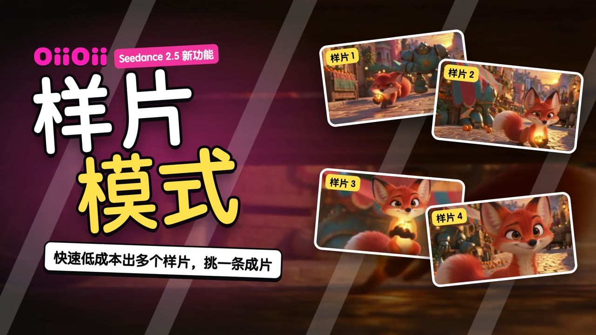
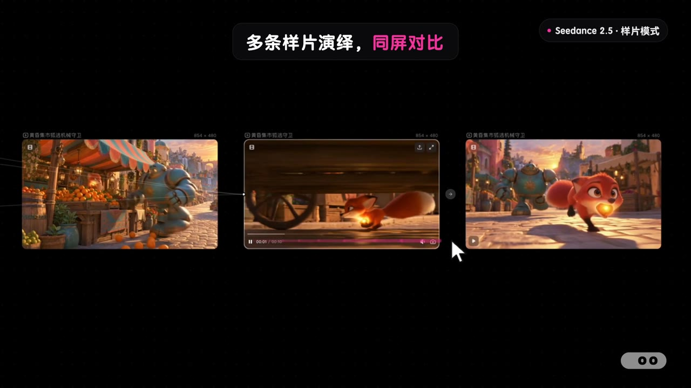
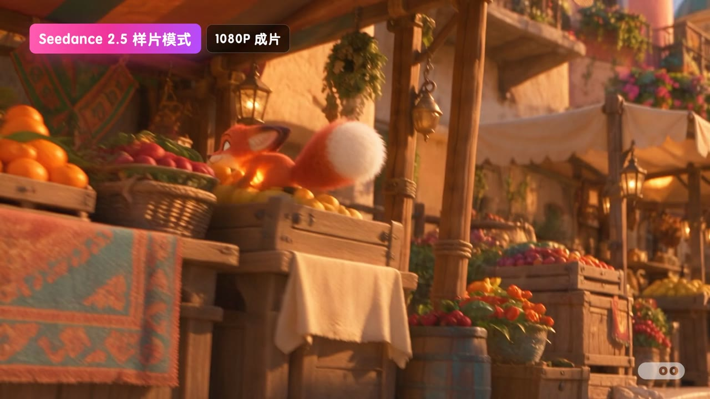

# Seedance 2.5 样片模式宣传片

OiiOii × Seedance 2.5「样片模式」宣传片：先快速、低成本地生成多条样片，同屏对比挑出满意的一条，再一键生成 1080p 成片。



| | |
|---|---|
| 状态 | ✅ 成品 v9（2026-10-01） |
| 成片 | [⬇️ 下载 1080p 成片（47MB）](https://github.com/junejuneli/oii-videos/releases/download/seedance25-sample-mode-v9/oiioii-seedance25-sample-mode-v9-1080p.mp4) · [Release 页面](https://github.com/junejuneli/oii-videos/releases/tag/seedance25-sample-mode-v9) |
| 规格 | 1920×1080，30fps，48 秒，H.264 + AAC，-16 LUFS |
| 录制画布 | `https://www.oiioii.ai/space/e331a6a5-...` |

## 内容

| 时间 | 段落 | 画面 |
|---|---|---|
| 0–2s | 封面 | 「样片模式」大标题 + 4 张样片卡片，卖点「快速低成本出多个样片，挑一条成片」 |
| 2–15s | 01–04 | 选参考 → 连线生成 → 写提示词 → 选择样片模式（流光框圈住开关） |
| 15–25s | 样片生成 · 同屏对比 | 加速等待，4 条样片同屏对比 |
| 25–35s | 05 选中成片 | 流光框圈住「成片 1080p」，成片生成中（加速），点放大过渡到全屏 |
| 35–45s | 1080p 成片 | 完整播放成片 |
| 43–48s | 落版 + 片尾 | 右上角 OiiOii × Seedance 2.5，左下角「低成本出样，选择即成片」，OiiOii 片尾 Logo |

| 同屏对比 | 1080p 成片 |
|---|---|
|  |  |

需求、素材和 v1–v9 的完整迭代记录见 [brief.md](brief.md)。

## 工程

```
src/
  Promo.tsx   时间线：recC 一镜到底的镜头表、步骤字幕、流光框、定格补丁、配乐
  Cover.tsx   封面
  Scenes.tsx  成片放大播放（FinalPlay）、落版（EndOverlay）、结尾定格
public/
  rec/recC.mp4   649s 画布录屏
  raw/           样片、成片原片和参考图
  assets/        成片转码、封面卡片、结尾帧
  patch/         剪掉“选分辨率”步骤用的定格补丁
  sfx/music.wav  配乐（scripts/make-music.mjs 合成，128 BPM）
media.lock.json  本地大文件清单
```

录屏、原片、配乐等大文件只在本地，不进 git；`pnpm media:check` 可以检查是否齐全。

```bash
pnpm --filter seedance25-sample-mode dev          # 打开 Remotion Studio
pnpm --filter seedance25-sample-mode release v10  # 渲染母版 + 分享版到 out/
```
